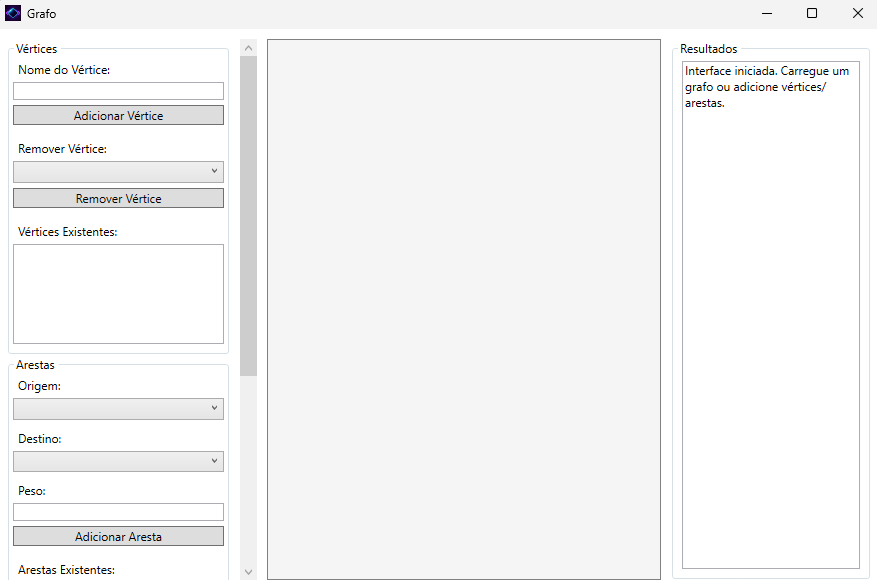
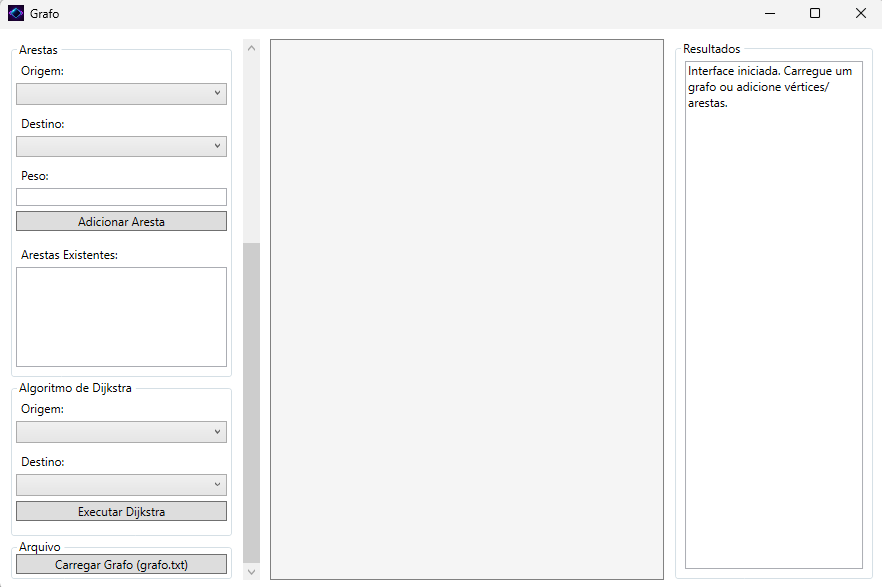
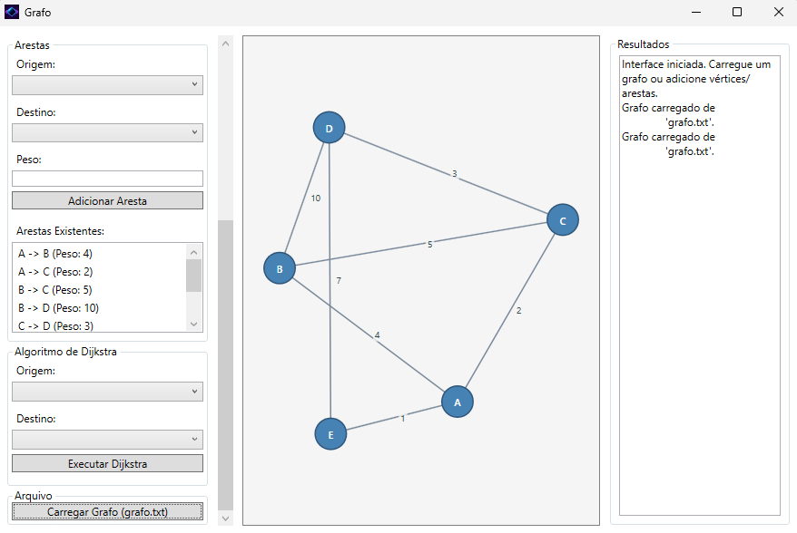
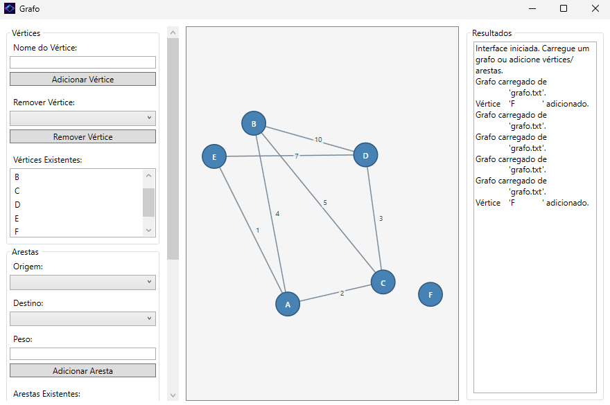
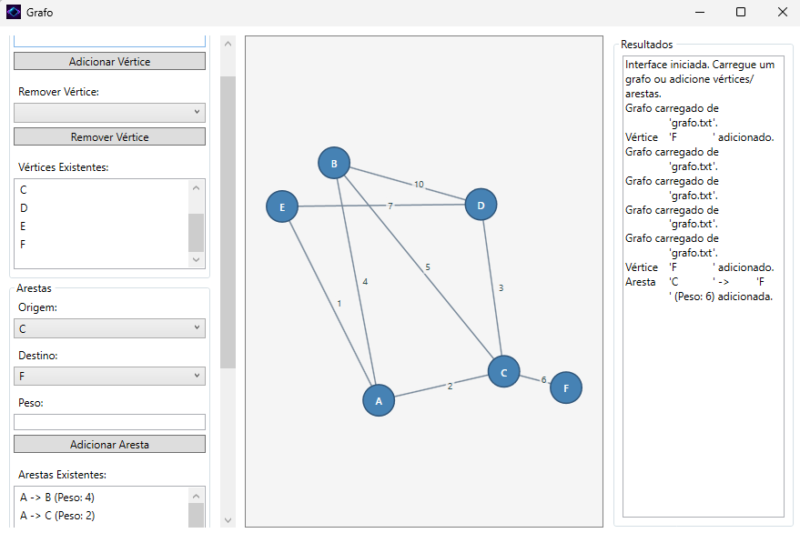
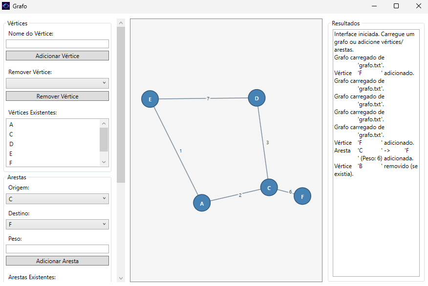

# 🌐 Projeto Grafo

Este projeto implementa estruturas e algoritmos de grafos de forma visual e funcional.

---

## 📌 Funcionalidades

- ✅ Criação e visualização de grafos
- ➕ Inserção e remoção de vértices e arestas
- 🔍 Execução de algoritmos:
  - Busca em Largura (BFS)
  - Busca em Profundidade (DFS)
  - Dijkstra (Menor Caminho)
- 🎨 Interface visual com exibição dos grafos

---

## 🧪 Tecnologias usadas

- 💻 Linguagem: C#
- 🖼️ Interface: WPF
- 🧠 Estrutura: Lista de adjacência

---

## 📸 Demonstrações

A seguir, prints do sistema funcionando:

<p align="center">
  
  
  <br/>
  
  
  <br/>
  
  
  <br/>
  
</p>

---

## 🚀 Como executar

1. Clone este repositório:

```bash
git clone https://github.com/seu-usuario/seu-repositorio.git
